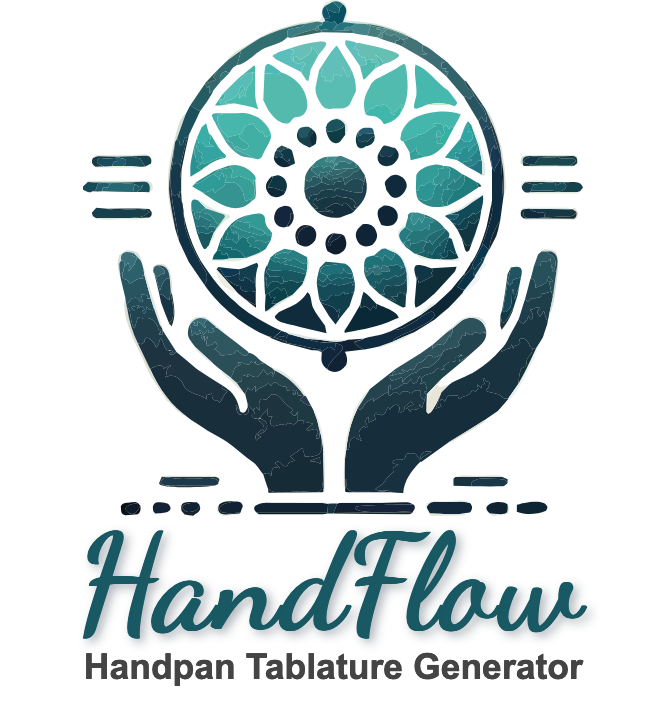

<p align="center">
  
</p>

# HandFlow

[](https://www.gnu.org/licenses/agpl-3.0)
[](https://www.rust-lang.org)
[](https://github.com/MusicFlow-app/HandFlow/issues)
[](https://github.com/MusicFlow-app/HandFlow/actions)

🎵 **HandFlow** - Your friendly neighborhood handpan tablature generator! 🚀

## What’s HandFlow?

Hey there! 👋 Welcome to HandFlow, a fun little project that helps you create handpan tablatures with ease. It’s a Rust-based web app that’s got a bit of everything you need to get those sweet, sweet handpan tunes flowing.

### Here’s what HandFlow can do:

- **🎼 Easy Peasy:** Generate handpan tablatures without breaking a sweat.
- **🎶 Flexible:** Works with handpans from 9 to 13 notes with all the go-to scales like Celtic, D Kurd, and more.
- **📄 MuseScore Integration:** Upload your `.mscz` files and let HandFlow do the rest.
- **🎛️ Customizable:** Adjust transpose settings and tweak the display however you like.
- **🪄 Auto-Transpose:** Don’t worry about fitting notes in—HandFlow’s got you covered.
- **🚀 Auto-Scroll:** Learn as you play with a handy auto-scroll feature. BPM adjustable, of course. 😉
- **✨ Other Cool Stuff:**
  - 📏 Resize your measures for that perfect view.
  - 👀 Toggle visibility for different elements to keep things clean.
  - 🎧 Real-time MIDI playback with custom waveform generation — because why not emulate ethereal sound with math?

## Demo


## Why Did We Make HandFlow? 🤔

So, I’m a handpan enthusiast who was looking for a simple, visual way to help me learn. HandFlow started as a personal project, but it’s grown into something pretty darn useful. It’s not perfect, but it’s definitely good enough to get the job done. 

New features are coming, if I find the time. 😅 And hey, if you want to pitch in, please do, that’d be awesome!

>HandFlow works best on a laptop or tablet, and it’s been tested on Firefox and Chrome.

## How to Get Started

1. **Clone the Repo:**
   ```bash
        git clone https://github.com/MusicFlow-app/HandFlow.git
        cd HandFlow
    ```

2. **Run the App:**
   ```bash
        cargo run
    ```

3. **Open Your Browser:**
   - Head over to [http://localhost:8080](http://localhost:8080)

4. **Upload Your Music:**
   - Drop in a `.mscz` file (MuseScore, LibreScore, whatever works for you).

5. **Choose Your Scale:**
   - Select your preferred scale from the dropdown.

6. **Pick Your Part:**
   - Choose which part you want to work with.

7. **Transpose & Generate:**
   - Adjust the notes or let HandFlow auto-transpose them for you. Hit “Generate” and you’re golden!

8. **Optional: Auto-Scroll & MIDI Synth:**
   - Enable these features to learn and play along with your new tablature.

## Stuff Used 🛠️

- **🤖 ChatGPT:** My go-to buddy for all function music parsing, music playback, brainstorming.
- **🎨 DALL·E:** The artistic genius behind the handpan and logo vector.
- **🍺 Homebrew & Cargo:** Essential tools for getting things up and running.
- **🚀 Actix Framework:** The backbone of this Rust-powered web app.
- **🖋️ Dancing Script Font:** For that extra touch of style. Check it out [here](https://www.fontsquirrel.com/fonts/dancing-script-ot?q%5Bterm%5D=dancing&q%5Bsearch_check%5D=Y).

## What’s Next? 🎯

Here’s what’s on my wishlist for HandFlow:

- **🔊 A better synth** to capture that ethereal handpan sound.
- **🌀 Smoother scrolling** for a more seamless learning experience.
- **𝄇  Repeat measures** in score and select on.
- **📄 PDF Export:** Because sometimes, you just want it on paper.
- **🎨 Enhanced UI/UX:** There’s always room to make things prettier.
- **📱 Mobile Support:** Let’s make it work perfectly on smaller screens!

---

HandFlow’s been a labor of love, and it’s already helping me (and hopefully you!) make some beautiful music. 🎶 Got ideas? Want to jump in and contribute? Go for it—we’re all about collaboration here. 🤘

☮ Happy drumming! 🥁